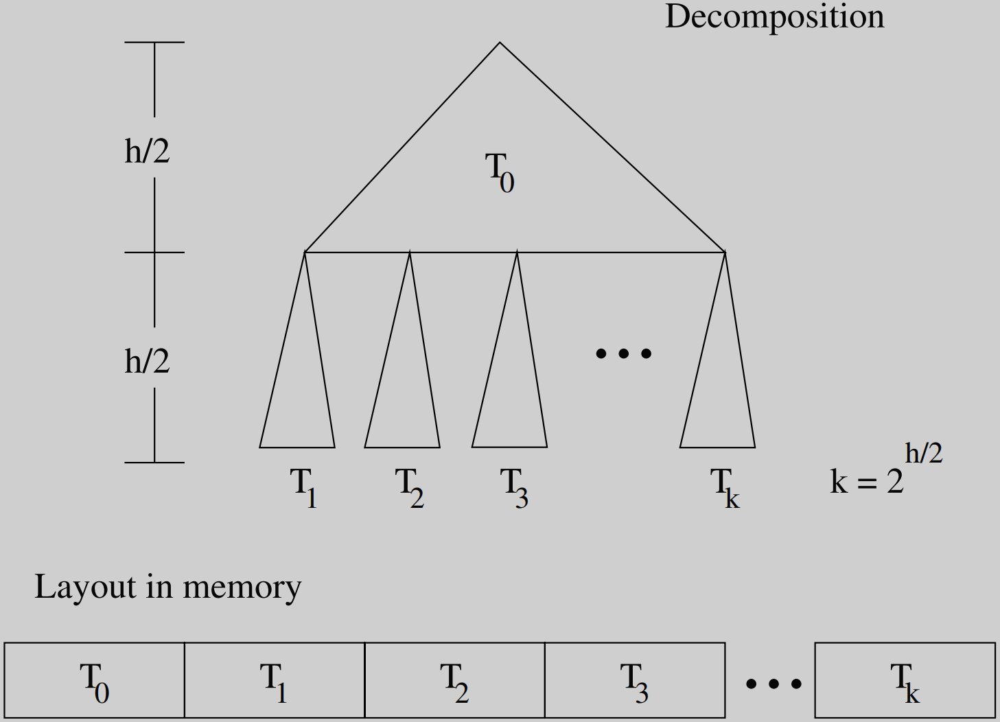

An experimental comparison of cache aware and cache oblivious static
search tree algorithms is presented. Both cache aware and cache oblivious algorithms outperform classic binarysearch on large data sets because
of their better utilization of cache memory. 

Cache aware algorithms with
implicit pointers perform best overall, 

but cache oblivious algorithms do almost as well and do not have to be tuned to the memoryblock size as
cache aware algorithms require. 

Program instrumentation techniques are
used to compare the cache misses and instruction counts for implementations of these algorithms.  

1 Introduction
Because of the time delay in moving the datum to the processor, typically
surrounding data is also transferred down the memory hierarchy in a block
that contains the required datum. This block transfer amortizes the transfer
time of all the data in the hope that not just the one datum is required,
but that surrounding data will be required soon. Typical block sizes are 1024
bytes from disk to main memory, 32 bytes from main memory to the level two
and level one caches, and four bytes from the level one cache to the registers.
Most algorithms are not designed with memory performance in mind and
probably shouldn’t be. However, there are cases where an algorithm is in the
“inner loop” where good memory performance is necessary. In these cases  

We summarize our main results as:
\1. In terms of execution time, both cache aware search with implicit pointers
  and cache oblivious search with explicit pointers perform comparably,
  and are both significantly faster the classic binary search.
\2. Cache aware search with implicit pointers has slightly better cache performance.
\3. Cache aware search with implicit pointers has slightly worse instruction count performance.
In summary, the cache oblivious approach is almost as effective as the cache aware approach to reducing cache misses for static search and has the advantage that it does not need to be tuned to the memory block size.  

3 Cache Aware Search
The basic idea is to store in the same memory block those items that are most likely accessed together in time. 

A simple way to achieve this is to use a k-ary tree where a node contains k - 1 items and k pointers to subtrees. 

To implement k-ary trees:

* explicit pointers 
  * memory used for pointers and padding
  * speed: following pointers rather than calculating them

* implicit pointers

Suppose that we know the cache line size is 32 bytes, and assume that an item and a pointer
each occupies four bytes, we can store at most four pointers and three items.
This means that our tree would be a 4-ary tree. Figure 4.1 depicts this example.   

use the whole memory block to store keys

the utilization of the memory blocks for explicit and implicit pointers is about the same. 

If binary search is done within a node, then in the explicit pointer case two items and one pointer are touched most
commonly. 

In the implicit pointer case three or four items are touched most commonly. 

The big win of implicit pointers is that the height of the tree, which bounds the number of cache misses, is much less.
For a k-ary tree, we layout the nodes in a contiguous piece of memory,
starting from the root node going down, and from left to right for nodes at the same height. 

If the nodes are stored in an array, 

  the root is stored at index 0 

  and the j-th child (1 ≤ j ≤ k) of the node stored at index i is stored at index ik + (k-1)(j+1). 

# 4 Cache Oblivious Search
Cache oblivious algorithms: 

  without any knowledge of the cache parameters

  guarantees that each cluster will span at most two memory blocks

Cache aware algorithms

Fig. 4.3. Cache oblivious search tree decomposition and layout in memory  

Given a binary search tree of h (assuming h is a power of 2) levels, the memory layout algorithm works as follows. 

Cut the tree in half vertically, leaving one subtree above the cut and 2^h/2^ subtrees below the cut

> A total of 2^h/2^ + 1 subtrees all of the same size. 

The top subtree is then placed in a contiguous block of memory followed by the 2^h/2^ subtrees from the left most to the right. 

The algorithm is then recursively applied to the top subtree followed by the bottom subtrees in left to right order. 

The algorithm terminates when it is applied to a subtree of one level, at which point it will add the single node into the array. 

Bender et al. [4.2] 

Brodal et al. [4.3] 

cache oblivious static search tree

Brodal et al. have discovered a very elegant and efficient way to calculate the pointers

we use a more computation intensive algorithm:

traversing the tree in Figure 4.3:

search at the root of the tree, the first level of the tree, and the initial “cut” is located at h, where h is the height of the tree. 

If the number of levels that separate the current node from the next cut is greater than or equal to two, 

  a new cut is placed halfway between the current level of the search and the level of the next cut. 

If the current node is at the same level as the next cut an inter-cut traversal is done. 

Otherwise an intra-cut traversal is done.
This process is repeated at the new node until the search succeeds or fails.
An intra-cut traversal is defined as follows. 

Let i be the index of the current node in the search. 

If the difference between the level of the current node and the level of the next cut is #, where # ≤ 2 the left child of the current node is
located at i+1 while the right child is located at i+2. 

An inter-cut traversal is done in the case that by moving to the next node in the traversal, 

  we cross over an existing cut. 

In this case, the next node is located in memory after all the nodes above the cut and after all the nodes between the cut 

  and the next cut in the subtrees to the left of the next node. 

If the number of levels in the tree above it is d and the number of trees to the left of it is s then j child (1 ≤ j ≤ 2) of the node indexed at i is located at (2s + j - 1)(2^l^ - 1) + 2^d+1^ - 1.  

2^d+1^ -1 is the number of nodes above the cut 

2^l^ - 1 is the number of nodes in each of the subtrees to the left of the next node. 

There are either 2s or 2s + 1 subtrees to the left of the next node depending on whether the traversal goes left or right respectively. 

A stack can be used to maintain the current cut by simulating the recursive construction described in Figure 4.3. 

The values of d and s can be maintained easily and the value of l can be calculated from the cut value and d.  

