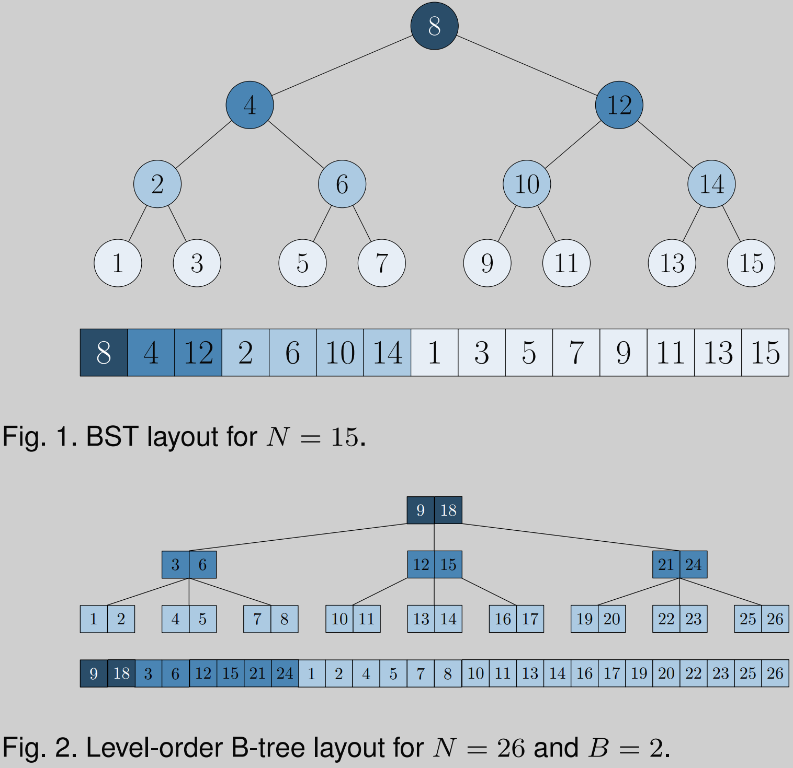
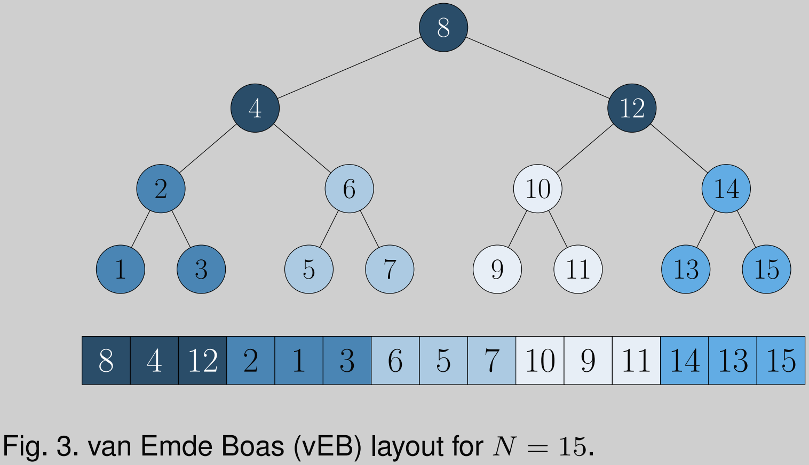

Abstract

level-order binary search tree (BST): 

  the breadth-first left-to-right traversal of a complete binary search tree

  sorted array

level-order B-tree (B-tree): 

  the breadth-first left-to-right traversal of a complete B-tree 
van Emde Boas (vEB)[14]

in-place

the vEB layout provides the best performance on the CPU. 
N=537 million 64-bit integers, the benefits of query performance (compared to binary search) outweigh the cost of in-place permutation when performing as few as 0.37% of N queries. 

...

The performance. 

[6] measure the cache performance and instruction count of querying the B-tree and vEB layouts, with results indicating that the B-tree layout achieves the best performance on CPUs. 

[5] indicate that the performance of the vEB and B-tree layouts are comparable, both outperforming the BST layout. 

[1] show that, by using explicit prefetching, the BST layout can outperform both the Btree and vEB layouts.  

